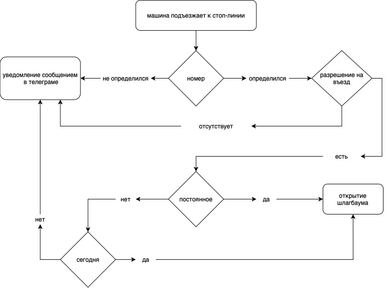

# Supervisor project

**Идея проекта заключается в использовании компьютерного зрения для контроля проезда машин на кпп.**
___
___
## Пример взаимодействия: 
Машины сотрудников организации заносятся в базу данных заранее. 
Любое иное лицо должно получить разрешение на въезд связавшись с представителем организации или получив разрешение другим способом, иначе шлагбаум не откроется.

## Технологии и компонены:
* Raspberry Pi 4 Model B 4Gb
* Raspberry Pi Camera Board, Version 2
* Python
* OpenCV
* NumPy
* sqlite3 or Django ORM
* Django/Flask
* pytelegrambotapi

## Поля базы данных:
* ФИО человека, получившего разрешение STRING
* Номер машины STRING
* Машина на территории BOOLEAN
* Постоянное разрешение на въезд BOOLEAN
* Диапазон дат, в которе разрешён въезд DATE - DATE
    * Диапазон времени, в которое можно находиться на территории TIME - TIME
* Человек, оформивший разрешение
* Дата выписанного разрешения DATE
    * Время выписанного разрешения TIME
